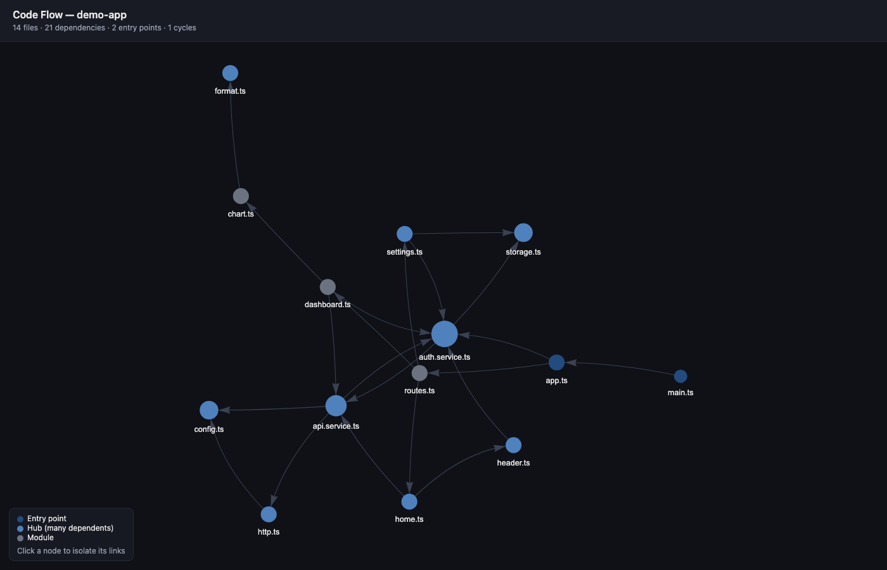

# code-flow-explainer

A Claude Code skill that explains how a codebase is wired: entry points,
dependency graph, hub files, and circular dependencies. It outputs a markdown
report with an embedded Mermaid diagram (renders right in your IDE) and an
interactive HTML graph, and Claude narrates the flow in plain language.



## Install

```bash
git clone https://github.com/mohammadsaadshafiq/claude-code-flow.git ~/.claude/skills/code-flow-explainer
```

or unzip so that `~/.claude/skills/code-flow-explainer/SKILL.md` exists.

To get the `/visual-flow` slash command as well:

```bash
mkdir -p ~/.claude/commands
cp ~/.claude/skills/code-flow-explainer/commands/visual-flow.md ~/.claude/commands/
```

## Use

- **`/visual-flow <what you want to see>`** — describe the flow you care about
  and Claude analyzes the repo, then narrates just that path through the code:

  ```
  /visual-flow the auth flow
  /visual-flow how src/app is wired
  /visual-flow what happens from main.ts to the database layer
  ```

- **`/code-flow-explainer`** — full analysis of the whole repo.

- Or just ask in plain language: *"explain the code flow of this repo"*.

Manual run (no Claude needed):

```bash
python3 ~/.claude/skills/code-flow-explainer/scripts/analyze.py .
```

Useful flags: `--dir src/app` (subfolder only), `--include ts,tsx,js,py`,
`--max-nodes 120` (cap graph size), `--out flow` (output name stem).

## Features

- TS/JS/JSX/TSX + Python, zero dependencies (Python stdlib only)
- Resolves relative imports, dynamic `import()` (Angular lazy routes),
  and **tsconfig path aliases** (`@core/*`, `@env`, ...)
- Entry points, hub files (blast radius), circular dependencies, orphans
- Safe on large/deep repos (iterative cycle detection, node caps)

## Outputs (generated in the analyzed project's root — gitignored here)

- `code-flow.md` — report with an embedded Mermaid diagram: renders as a real
  diagram right in your IDE's markdown preview (VS Code, JetBrains, Cursor)
  and on GitHub, plus entry points, hubs, and cycles
- `code-flow.html` — interactive board-style graph (shown above): drag, zoom,
  filter files by name, click a node to isolate its in/out edges; circular
  dependencies are drawn in dashed red
- `code-flow.json` — machine-readable summary, only with `--json`
